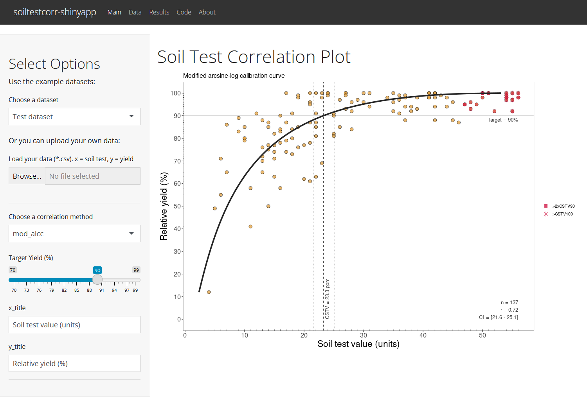
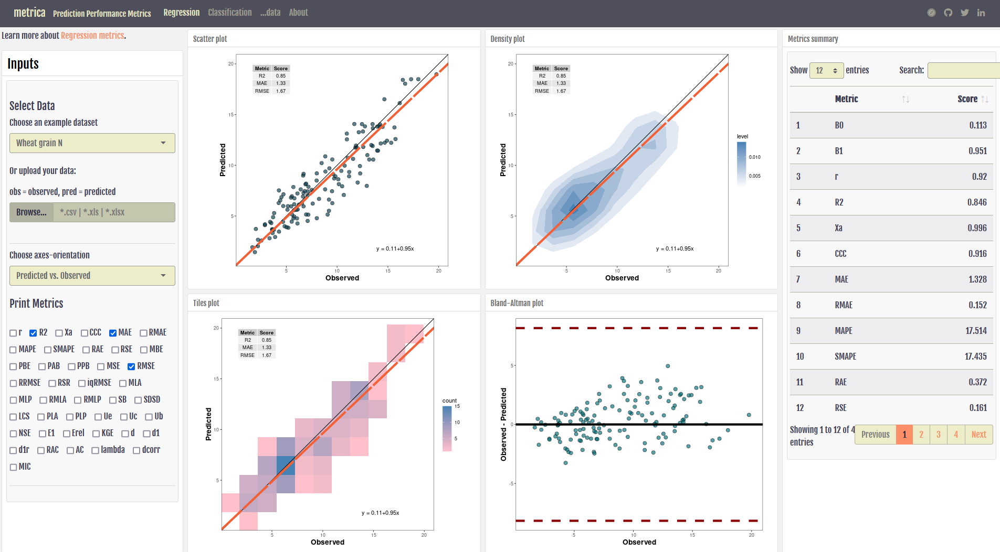
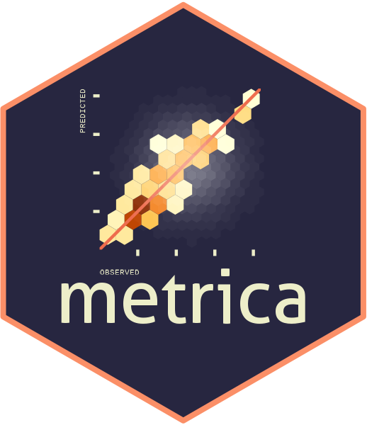
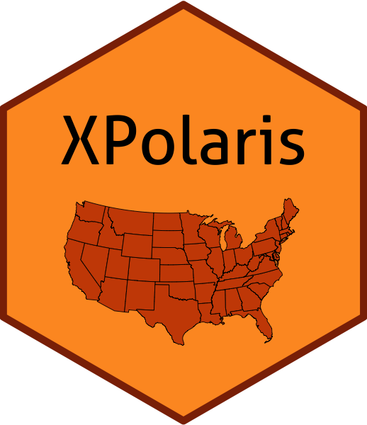
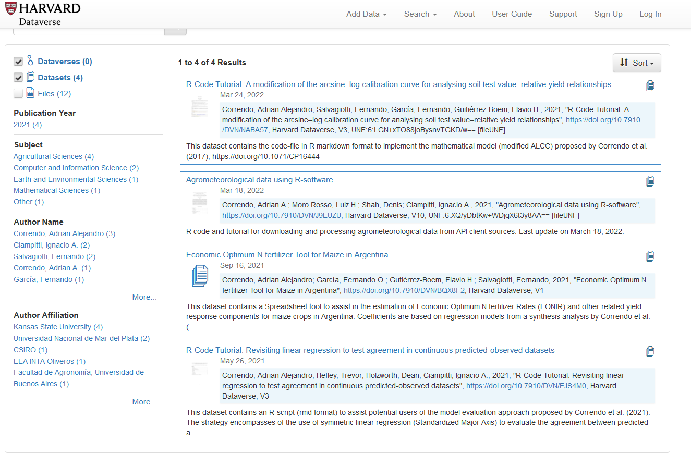

## Adrian Correndo, PhD

Welcome! Here you can check the latest updates on my digital tools projects.

### Shinyapps

[1. soiltestcorr demo app](https://soiltestcorr.herokuapp.com/)

[2. corny0 app](https://corn-y0-forecast.herokuapp.com/)

[3. metrica demo app](https://acorrendo.shinyapps.io/shiny_metrica/)

### R-packages

[1. soiltestcorr: Soil test correlation & calibration in R](https://adriancorrendo.github.io/soiltestcorr/)

[2. metrica: Prediction performance metrics in R](https://adriancorrendo.github.io/metrica/)

[3. Xpolaris: an R-package to retrieve United States soil data at 30-meter resolution](https://github.com/cran/XPolaris)

### [Harvard Dataverse Repository](https://dataverse.harvard.edu/dataverse/adriancorrendo)

### Video tutorials

[Agro-meteorological data using R software](https://www.youtube.com/watch?v=gJo5XUFtDPk)

[Regression Tress and Random Forests](https://www.youtube.com/watch?v=sE8VyX2XGII)

For more details see my [webpage](https://correndo1.wixsite.com/main)

### Contact me
e-maill: correndo@ksu.edu
